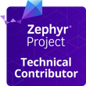

<h1 align="center">Hi 👋, I'm Sidhartha Raghaw</h1>

  &nbsp;
  &nbsp;
  &nbsp;
  

---

### 🏅 Verified Open Source Accomplishments

**[Zephyr Project Technical Contributor]**  
*Issued by The Linux Foundation*

---

## 🛠️ My Tech Stack

### 🧠 Firmware & Core Languages

### 📱 Mobile & Application Development

  
 

### 🖥️ IDEs & Tools
   

    

### 🎮 Gaming & Hardware Interests

---

  <b>🚀 Open for collaborations.</b>  

  

